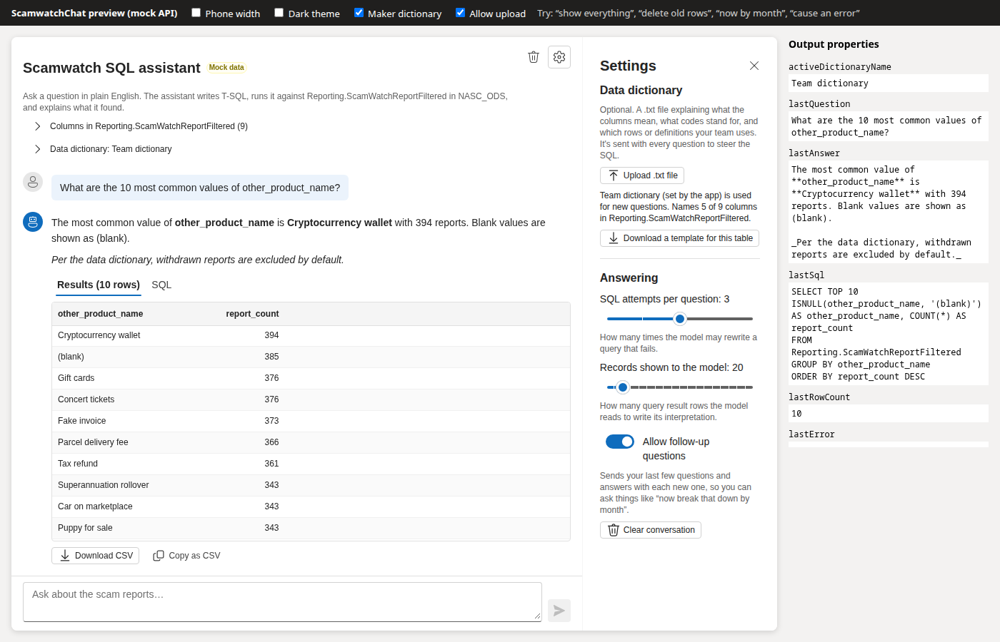

# ScamwatchChat: a Power Apps code component for Text-to-SQL

Ask questions about a SQL table in plain English from inside a canvas app or a
model-driven app. The control is the chat UI from the Streamlit
Scamwatch SQL assistant, rebuilt as a PCF (Power Apps component framework)
React control. It sends each question to a Text-to-SQL API (a wrapper around the
Python `TextToSQLAgent`), then shows the answer, the full result table (with CSV
download), the SQL and any failed attempts.



- Works in **canvas** and **model-driven** apps (no `Xrm` or Dataverse calls).
- **Data dictionary**: users upload a `.txt` file, or the app maker supplies one, and it's sent with every question.
- **Follow-up questions**: recent questions and the SQL behind each answer are sent as context.
- Results tables of **50,000 rows** scroll smoothly (virtualised) and download as CSV.
- **Mock mode** with built-in sample data, so you can try it with no backend.
- Uses the platform's React 16 and Fluent UI v9, so the bundle is small and it follows the app's theme.

> The Python agent and its API aren't in this repo. [docs/API_CONTRACT.md](docs/API_CONTRACT.md) says exactly what the API must do.

---

## Quick start on Bazzite (or any Linux)

Bazzite is an immutable Fedora system, so the toolchain (Node 20, .NET 8, the
Power Platform CLI `pac`, Chromium) lives in a container rather than on the host.
Choose one of these two paths.

**A. Dev container (VS Code or Antigravity).** Install the *Dev Containers*
extension. `.vscode/settings.json` already points it at Podman. Then run
**Dev Containers: Reopen in Container**. The first build runs `npm ci` and
installs Chromium.

> If you use VS Code from Flathub, it can't reach Podman from its sandbox. Use the RPM/tarball VS Code, or path B.

**B. Distrobox.**

```bash
bash scripts/bazzite-setup.sh          # creates the "pcf-dev" box with Node 20, .NET 8, pac
distrobox enter pcf-dev
npm ci && npx playwright install chromium
code .                                 # or: antigravity .
```

Then, in either path:

```bash
npm test          # 57 unit and UI tests, about 20 s
npm run preview   # open http://localhost:5173: the control with sample data
```

## Seeing the output

| What | Command / VS Code task | Where to look |
|---|---|---|
| **Control with sample data** | `npm run preview` / task **Preview** | `http://localhost:5173` in your browser or VS Code's *Simple Browser*. The toolbar switches phone width, dark theme, maker dictionary and uploads; the right panel shows the output properties the app would receive |
| **Official PCF test harness** | `npm run start:watch` / task **Start harness** | `http://localhost:8181`. In the right panel set **useMockApi = True** and clear the `val` the harness puts in `exampleQuestions` and `dataDictionary` |
| Unit tests | `npm test` / task **Test** | Terminal, or the Testing panel (Jest extension). `npm run test:coverage` writes `coverage/lcov-report/index.html` |
| Lint | `npm run lint` / task **Lint** | Problems panel |
| Built control | `npm run build` | `out/controls/ScamwatchChat/bundle.js` |
| **Solution to import** | `npm run solution` / task **Build solution** | `Solution/bin/Release/ScamwatchChatSolution.zip` (unmanaged) and `…_managed.zip` |
| Screenshots | `npm run screenshot` | `docs/screenshot*.png` |

Debugging: the launch configs **Debug preview (mock data)** and **Debug in PCF
harness** open Chrome with breakpoints in the TypeScript source.

The preview also takes URL parameters, handy for screenshots:
`?width=narrow`, `?theme=dark`, `?dictionary=maker`, `?uploads=off`,
`?ask=How%20many%20reports`. In mock mode, these questions show each state:
"how many…", "most common…", "now by month", "show everything" (50,000 rows),
"delete old rows" (failed attempts), "cause an error", "nothing".

## Commands

| Command | Does |
|---|---|
| `npm ci` | Install exact dependencies |
| `npm run build` / `build:prod` | Build the control with `pcf-scripts` (runs ESLint too) |
| `npm run start:watch` | PCF test harness on :8181, rebuilds on save |
| `npm run preview` | Vite preview with the mock API on :5173 |
| `npm test` | Jest + React Testing Library |
| `npm run lint` / `lint:fix` | ESLint (TypeScript, React, Power Apps rules) |
| `npm run typecheck` | `tsc --noEmit` (run `npm run refreshTypes` first on a fresh clone) |
| `npm run icons` | Regenerate `components/icons.tsx` after adding an icon name |
| `npm run screenshot` | Playwright screenshots of the preview into `docs/` |
| `npm run solution` | Build the solution zips (needs `dotnet` and `pac`; creates `Solution/` on first run) |
| `pac pcf push --publisher-prefix scw` | Push the control straight to the dev environment you're signed in to (`pac auth create` first) |

## Add it to an app

1. Build or download the solution zip (CI uploads it as an artifact on every push).
2. In [make.powerapps.com](https://make.powerapps.com): **Solutions → Import** the zip.
3. **Canvas apps:** in the Power Platform admin center, turn on *Allow publishing
   of canvas apps with code components* for the environment. Then in the app go
   to **Insert → Get more components → Code → ScamwatchChat**.
   **Model-driven apps:** add it to a custom page (the same steps as canvas), or
   bind it to any text column on a form.
4. Set the properties below. To try it first, set **Use sample data** (`useMockApi`) to On.

The control calls your API directly, so its manifest declares
`external-service-usage`. **That makes the app premium**: users need a Power
Apps premium licence. Before building for production, replace the placeholder
domain in `ControlManifest.Input.xml` with your API's host.

### Properties

Inputs:

| Property | Type | Default | Notes |
|---|---|---|---|
| `apiBaseUrl` | Text | | API root, e.g. `https://scamwatch-sql-api.example.com` |
| `apiScope` | Text | | e.g. `api://<api-app-id>/Query.Run` |
| `clientId` | Text | | SPA app registration used to sign in |
| `tenantId` | Text | | Empty allows any work account |
| `redirectUri` | Text | page origin | Must be on the **same origin as the page hosting the control**, and registered as an SPA redirect URI. The sign-in prompt shows the value to register |
| `useMockApi` | Yes/No | No | Built-in sample data, no backend |
| `title`, `placeholder` | Text | Streamlit's text | |
| `exampleQuestions` | Multiline | the 3 Streamlit examples | One per line |
| `showTableOverview` | Yes/No | Yes | Columns, sample rows, dictionary viewer |
| `defaultMaxAttempts` | Number | 3 | 1–5; users can change it in Settings |
| `defaultPreviewRows` | Number | 20 | 10–100; users can change it in Settings |
| `allowFollowUps` | Yes/No | Yes | Initial value of the follow-ups switch |
| `historyTurns` | Number | 3 | Question/answer pairs sent for follow-ups |
| `dataDictionary` | Multiline | | Team dictionary, e.g. from a Dataverse or SharePoint text column. A user's upload overrides it |
| `dataDictionaryName` | Text | Team dictionary | Label for the above |
| `allowDictionaryUpload` | Yes/No | Yes | Off = always use `dataDictionary` |

Outputs (read them in `OnChange`, e.g. to log questions to Dataverse):
`lastQuestion`, `lastAnswer`, `lastSql`, `lastRowCount`, `lastError`,
`activeDictionaryName`.

### Sign-in checklist (Entra ID)

1. **API app registration**: expose a scope such as `Query.Run`.
2. **SPA app registration** (`clientId`): add a delegated permission to that scope and grant admin consent. Under **Single-page application**, add redirect URIs for every origin the control runs on, e.g. `https://apps.powerapps.com`, `https://<org>.crm6.dynamics.com`, and the canvas player origin your tenant uses (the sign-in prompt shows it).
3. The API allows those same origins through CORS (see the [API contract](docs/API_CONTRACT.md)).

Sign-in is silent when the browser allows it. Otherwise the control shows a
**Sign in** button that opens a popup, so pop-ups must be allowed.

---

## Architecture

```
ScamwatchChat/
  ControlManifest.Input.xml   properties, platform libraries (React 16, Fluent 9), external-service-usage
  index.ts                    PCF entry: reads properties, builds the API client once per setting, raises outputs
  defaults.ts                 default title, placeholder, example questions
  types.ts                    API contract + UI state types (source of truth)
  components/
    ChatApp.tsx               root: loads /schema, layout, settings drawer, wires useChat
    Header.tsx                title, caption, Clear and Settings buttons
    TableOverview.tsx         columns (+ In dictionary), sample rows, dictionary viewer
    ExampleQuestions.tsx      starter questions + "upload a dictionary" hint
    ChatTranscript.tsx        user/assistant turns, thinking row with Stop
    AssistantMessage.tsx      error, markdown answer, data note, Results/SQL/Failed tabs, CSV
    ResultsGrid.tsx           virtualised sortable table (react-window)
    SqlBlock.tsx              code block with copy
    Composer.tsx              question box: Enter sends, Shift+Enter for a new line
    SettingsDrawer.tsx        inline drawer ≥ 900 px wide, overlay below (replaces the Streamlit sidebar)
    DictionarySection.tsx     upload / replace / remove, status, truncation warning, template download
    AnsweringSection.tsx      attempts slider, follow-ups switch, Clear
    SignInPrompt.tsx          interactive sign-in when silent sign-in fails
    icons.tsx                 GENERATED inline SVG icons (npm run icons)
  services/
    auth.ts                   MSAL: silent → ssoSilent → popup
    apiClient.ts              fetch with timeout/abort, 401 retry, readable errors; MisconfiguredChatApi
    mockApi.ts                sample data and canned scenarios
  state/
    useChat.ts                reducer + hook: messages, pending, settings, dictionary precedence
    storage.ts                sessionStorage persistence (survives canvas screen changes)
  utils/
    dictionary.ts             ports of decode_text, prepare_data_dictionary, columns_mentioned, …
    format.ts                 rowLabel, buildHistory, toCsv, downloads, protectIdentifiers
    strings.ts                UI text defaults + translator (keys mirror the .resx)
  strings/ScamwatchChat.1033.resx   all display text (manifest + UI)
  __tests__/                  Jest tests
dev/                          Vite preview page (mock API)
scripts/                      bazzite-setup.sh, build-solution.sh, generate-icons.mjs, screenshot.mjs
docs/                         API contract, sample dictionary, screenshots
```

Data flow: `Composer → useChat.ask → ChatApi.query (apiClient or mockApi) → toAssistantMessage → AssistantMessage`.
Dictionary: `DictionarySection → readDictionary → useChat.setUploaded → activeDictionary() → /query.dataDictionary`.

### Streamlit parity

| Streamlit `app.py` | Here |
|---|---|
| `st.title` + caption | `Header` |
| Sidebar: Connection | Not in the UI: backend config. `apiBaseUrl` and related properties |
| Sidebar: Data dictionary (`render_dictionary_settings`) | `DictionarySection` |
| Sidebar: Answering (`render_answering_settings`) | `AnsweringSection` |
| `render_table_overview` | `TableOverview` |
| `render_examples` | `ExampleQuestions` |
| `render_answer` | `AssistantMessage` (`answerTabs()` holds the tab rules) |
| `st.dataframe` / `to_dataframe` / `_arrow_safe` | `ResultsGrid` (values arrive JSON-safe from the API) |
| `st.download_button` CSV (`utf-8-sig`) | `toCsv` (UTF-8 BOM) + `downloadText` |
| `escape_dollars` | Not needed (no LaTeX); `protectIdentifiers` stops `snake_case` turning italic |
| `build_history`, `row_label` | `buildHistory`, `rowLabel` |
| `decode_text`, `columns_mentioned`, `read_dictionary`, `dictionary_template`, `template_file_name` | same names in camelCase in `utils/dictionary.ts` |
| `prepare_data_dictionary` (agent) | `prepareDataDictionary` |

---

## For AI coding agents

This section is written for coding agents (Antigravity, Claude Code, Copilot,
Cursor) working in this repo. `AGENTS.md` points here.

### Ground rules

- **UI libraries**: use only `@fluentui/react-components` (Fluent v9) and React 16 APIs. Both come from the platform at runtime (see `<platform-library>` in the manifest), so don't upgrade React past 16.14 or use React 18 APIs (`createRoot`, `useId` from React, `useTransition`). Use Fluent's `useId`.
- **Icons**: don't import `@fluentui/react-icons` in control code; it breaks the build (its bundled Griffel needs `react/jsx-runtime`). Add the icon's name to `scripts/generate-icons.mjs`, run `npm run icons`, and import it from `./icons`.
- **No `Xrm`, `context.webAPI` or `context.navigation`**: the control must work in canvas apps.
- **Text**: every user-visible string is a key in `DEFAULT_STRINGS` (`utils/strings.ts`) **and** a `<data>` entry in `strings/ScamwatchChat.1033.resx`. A test fails if they drift apart. Read strings with `useStrings()`.
- **Python parity**: functions in `utils/dictionary.ts` and `buildHistory`/`rowLabel` must behave exactly like their Python twins, which each docstring names. When changing one, run the Python original on the same input and put its output in the test as the expected value.
- **API contract**: change `types.ts` first, then `mockApi.ts`, `apiClient.ts` and `docs/API_CONTRACT.md` together.
- **Styling**: `makeStyles` + `tokens` only (no hard-coded colours), so dark and host themes work. Combine classes with `mergeClasses`.
- **Never commit** secrets, tenant or client IDs, real API URLs or real data dictionaries. Example values go in `docs/`.

### Definition of done

```bash
npm run lint && npm test && npm run build
```

All three must pass. For UI changes, also run `npm run screenshot` and look at
`docs/screenshot*.png` (or `npm run preview`). When you add, rename or remove a
manifest property, bump `version` in `ControlManifest.Input.xml`, or Power Apps
won't pick up the change on import.

### Recipes

**Add a manifest property**
1. Add `<property>` to `ControlManifest.Input.xml` with `display-name-key`/`description-key`.
2. Add both keys to the `.resx` (a test checks this).
3. `npm run refreshTypes` regenerates `generated/ManifestTypes.d.ts`.
4. Read it in `index.ts` `updateView` and pass it as a `ChatAppProps` prop. Add the same prop in `dev/preview.tsx` and `renderApp` in `__tests__/ChatApp.test.tsx`.
5. Document it in this README's property table and bump the manifest version.

**Add an output property**: add `usage="output"` to the manifest, add the field to `ControlOutputs` (`types.ts`) and `getOutputs()` (`index.ts`), and report it through `onOutputs`.

**Add a tab to an answer**: extend `AnswerTab` and `answerTabs()` in `AssistantMessage.tsx`, render its panel, add string keys, and add a case to the `answerTabs` test.

**Change the API contract**: edit `types.ts`, then `mockApi.ts` (so the preview and tests exercise it), `apiClient.ts` if the transport changes, `toAssistantMessage()` in `useChat.ts`, and `docs/API_CONTRACT.md`.

**Change dictionary rules** (e.g. the Python side raises `MAX_DICTIONARY_CHARS`): the server should report it in `/schema` `limits.maxDictionaryChars`. Change `DEFAULT_MAX_DICTIONARY_CHARS` in `utils/dictionary.ts` only as the fallback.

### Gotchas

- The PCF harness fills every text property with `val`. Clear them, or set `useMockApi`, before judging behaviour there.
- jsdom lacks `ResizeObserver` and real `TextDecoder`s; `__tests__/setup.ts` provides them. Fluent prints a harmless *Keyborg … disposed incorrectly* warning in tests.
- Node's `TextDecoder('windows-1252')` behaves like latin-1, which is why cp1252 is decoded with a table in `utils/dictionary.ts`.
- MSAL popups need a redirect URI on the host page's origin; a URI on the API's host can't work.
- `generated/` and `out/` are build output. Don't edit or commit them.

## Licence

MIT. Icons are from [Fluent UI System Icons](https://github.com/microsoft/fluentui-system-icons) (MIT).
